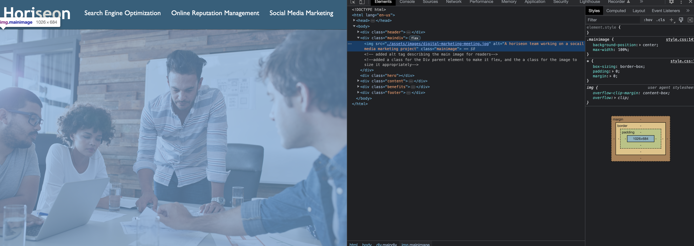

# <Sam's-code-refactor-challenge!>

## Enhance search engine optimization and accesibility for Social Media Marketing company, Horiseon.
 - Improve the logical structure of the HTML elements.
 - Improve alt attributes on the image
 - increase overall accessibility of the site.
 - consolidated css code.

 ## Installation

 - URL for website is supplied, html and css are also ready for deployment in public repository.

 ## Usage

```md

```
## Credits
Coding Boot Camp
https://github.com/coding-boot-camp/urban-octo-telegram

